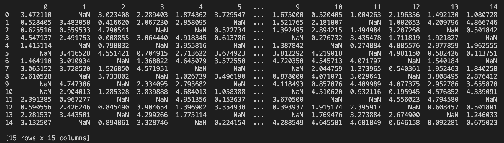
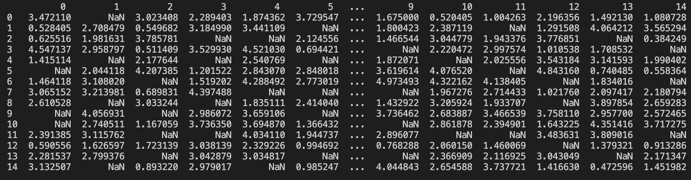
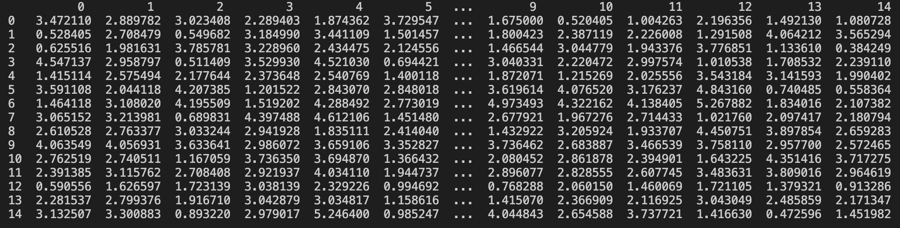
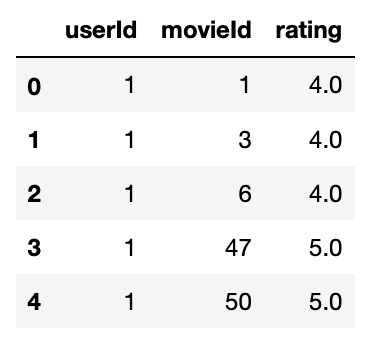

# collaborative_filtering

This program takes in a 2D matrix whose rows are user ID's and columns are rated items' IDs. Value in a cell represent how the user at this row rated the item at this column. 

Every item, and every user has a 1 by 5 vector and a bias value  associated with them. The rating can be represented as the sum of the biases and the dot product of the two vectors. 

During training, these vectors and biases are randomly initialized. The mean squared error is minimized through gradient descent. Once we have successfully calculated values for the vectors and biases, we can use these values to predict how a user would rate an item. 

## Technologies

- Python 3.8.5
- Pandas

## Illustration

Below is a dataset where rows correpond to users and columns correspond to items. A user can rate an item with a value between 0 and 5. The NaN values indicate that the user has not rated this item. 

The next image demonstrates the predictions that our model made after 300 epochs. 

Then, the vector and biases that were calculated can be used to predict the NaN values: to predict how the user would rate an unrated item. The image below indicates the predictions that were made by our model.

## Inspiration

This project is an extension of one of the assignments we have completed for the Neural Networks course at Harvey Mudd College, taught by Elizabeth Sweedyk.

## Collaborators
Juan Diego Herrera & Iren Azra Coskun

## Formatting Suggestions

If the data looks like the example below, there are additional lines of code (that are currently commented out) at the beginning of the initialize_and_train method to guide the data frame manipulation process.

